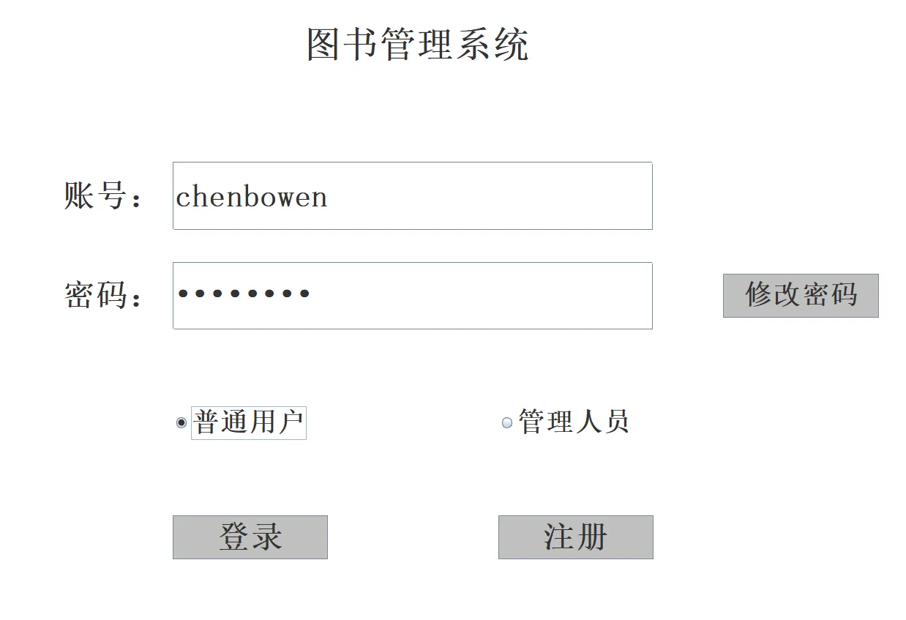
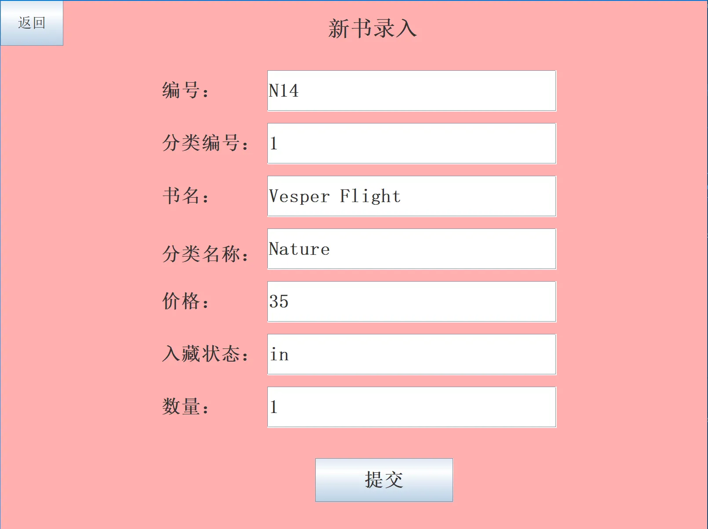
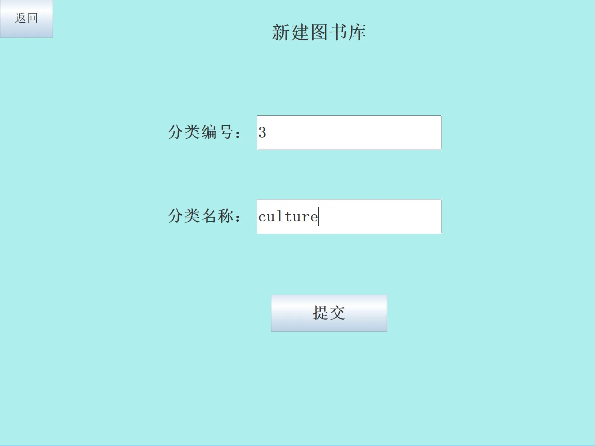
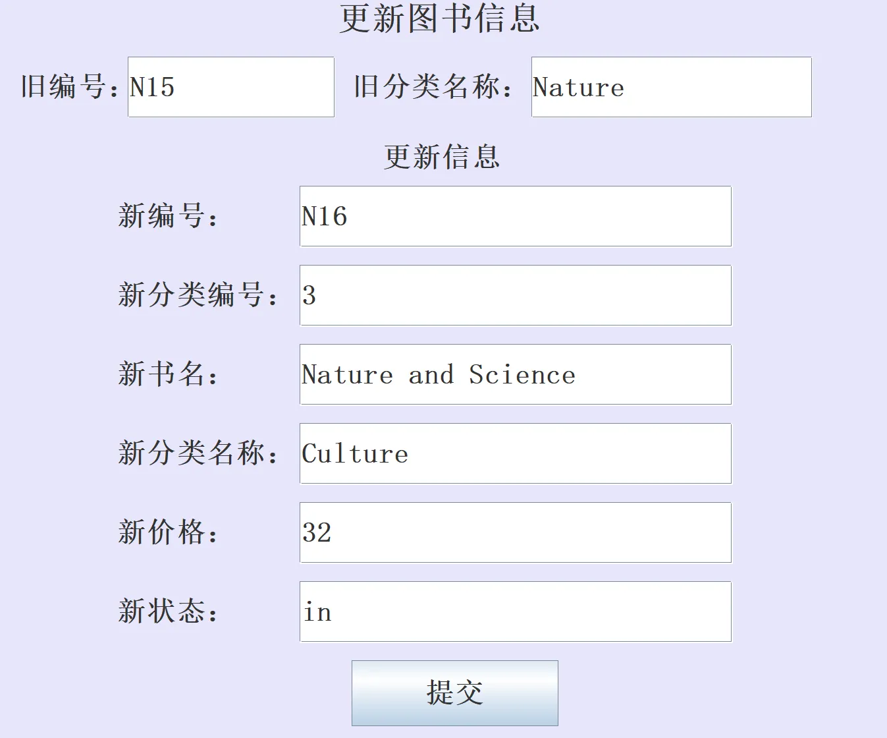
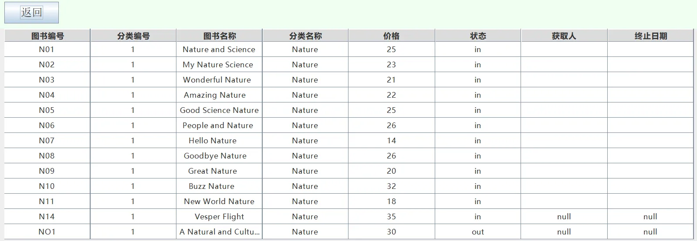
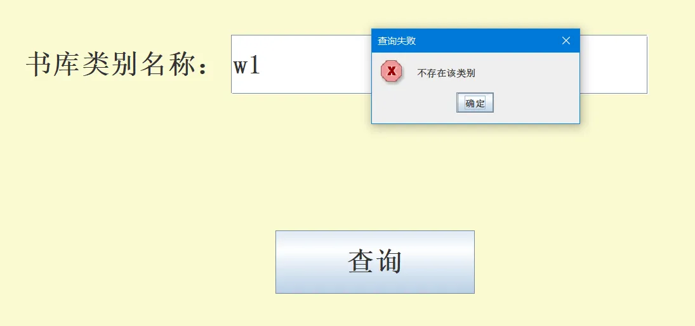
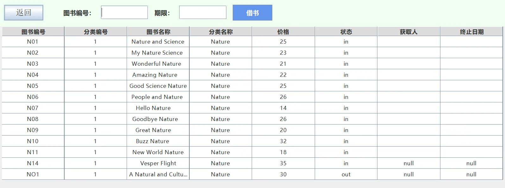
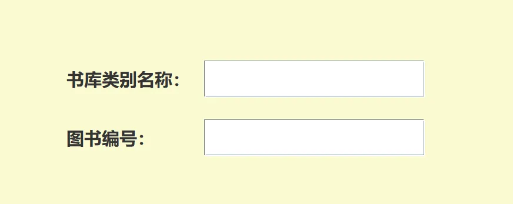
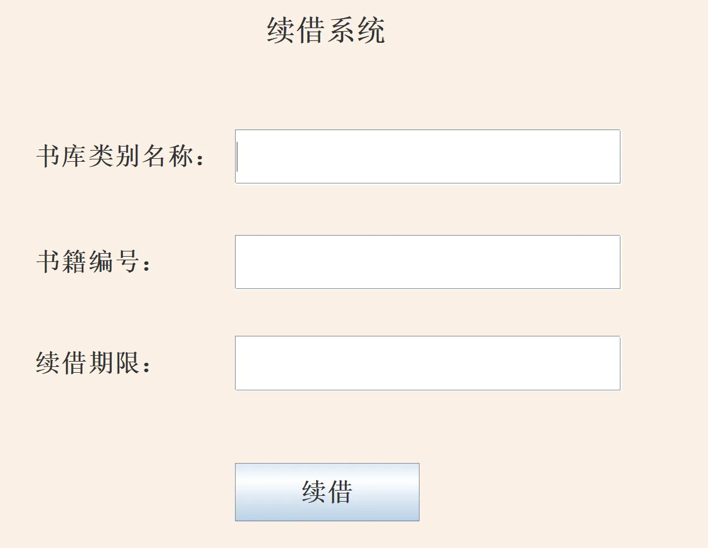
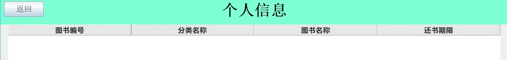

# 主界面 MainInterface



通过按钮组 控制只能选择一个按钮

```java
ButtonGroup bg=new ButtonGroup();
        bg.add(rb_user);// 普通用户
        bg.add(rb_manager);// 管理人员
```

## 管理员界面 ManagerInterface


### 新书录入
连接 bookManageSYS 数据库,并在 naturebook 表中新增图书



### 新设类别
新建 table 表



### 更新信息


### 馆藏状态
jTable 和 tablemodel 设计,将其设计为不可编辑,并且添加滚动条



```java
private static JTable bookTable;             //表格
private static DefaultTableModel tableModel; // 表格的数据模型

tableModel = new DefaultTableModel(columnNames, 0) {
            @Override
            public boolean isCellEditable(int row, int column) {
                return false;
            }
        };
JScrollPane scrollPane = new JScrollPane(bookTable);
```

### 信息错误修正
使用 JoptionPane.showMessageDialog 弹出错误信息弹窗



## 普通用户界面 UserInterface
### 借书


### 还书


### 续借


### 个人信息


# 数据库 Table
### 1. 核心数据库
+ 数据库名称: `BookManageSYS`

### 2. 用户与权限表
这两个表结构完全一致，用于存储登录信息。

| 表名 | 字段名 | 类型 | 说明 |
| :--- | :--- | :--- | :--- |
| **Manager** | `manager_user` | VARCHAR(255) | **主键**, 管理员用户名 |
|  | `manager_password` | VARCHAR(255) | 管理员密码 |
| **Customer** | `customer_user` | VARCHAR(255) | **主键**, 用户名 |
|  | `customer_password` | VARCHAR(255) | 用户密码 |


### 3. 图书信息表 (分表设计)
根据文件内容，目前有 `NatureBook` 和 `ScienceBook` 两张表。  
**注意：** 表最初创建时只有 7 列 ，但后面通过 `ALTER TABLE` 语句增加了 3 列（借阅人、借出日期、归还日期）。

表名：`NatureBook` / `ScienceBook`

| 字段名 | 类型 | 描述 |
| :--- | :--- | :--- |
| `number` | VARCHAR(255) | **主键**, 书籍编号 (如 'N01', 'S01') |
| `classnumber` | VARCHAR(255) | 类别编号 |
| `name` | VARCHAR(255) | 书名 |
| `classname` | VARCHAR(255) | 类别名称 (如 'Nature') |
| `price` | VARCHAR(255) | 价格 |
| `state` | VARCHAR(255) | 状态 ('in' 在馆 / 'out' 借出) |
| `total` | VARCHAR(255) | 总数量 |
| `current` | VARCHAR(255) | **新增列**, 当前借阅人 |
| `dateon` | VARCHAR(255) | **新增列**, 借出日期 |
| `dateoff` | VARCHAR(255) | **新增列**, 应还/归还日期 |


### 4. 个人借阅记录表
文件中创建了一个名为 `user` 的表 ，结合上一段 Java 代码来看，这通常是为每个注册用户单独创建的表（例如 `wangshaoyongCustomer`）。

**表名模板：**`user`** (或 **`[用户名]Customer`**)**

| 字段名 | 类型 | [cite_start]描述 [cite: 220] |
| :--- | :--- | :--- |
| `number` | VARCHAR(255) | **主键**, 书籍编号 |
| `classname` | VARCHAR(255) | 类别名称 |
| `name` | VARCHAR(255) | 书名 |
| `dateoff` | VARCHAR(255) | 期限 (应还日期) |


### 5. 临时测试表
这是一个用于测试连接或数据的临时表。

**表名：**`temp`

| 字段名 | 类型 |
| :--- | :--- |
| `number` | INT(11) |
| `name` | VARCHAR(255) |
| `location` | VARCHAR(255) |


# 数据库操作 sqlConn
使用静态代码,使类加载时只加载一次驱动

```java
static {
        try {
            Class.forName(Basic_Information.DBDRIVER);
        } catch (ClassNotFoundException e) {
            throw new RuntimeException("加载数据库驱动失败", e);
        }
    }
```

私有辅助方法,数据库连接

```java

private static Connection getConnection() throws SQLException {
return DriverManager.getConnection(Basic_Information.DBURL, Basic_Information.DBUSER, Basic_Information.DBPASS);
}
```

### PreparedStatement 接口
防止 sql 注入,预处理提高效率,使用问号占位符

```java
 String sql = "SELECT count(*) FROM " + table + " WHERE " + userCol + " = ? AND " + pwdCol + " = ?";
        try (Connection conn = getConnection();
             PreparedStatement pstmt = conn.prepareStatement(sql))
```

### 结果集查询
使用 count 统计匹配数据记录

```java
String sql = "SELECT count(*) FROM " + table + " WHERE " + userCol + " = ?";
try (Connection conn = getConnection();
     PreparedStatement pstmt = conn.prepareStatement(sql)) {

    pstmt.setString(1, user);
    try (ResultSet rs = pstmt.executeQuery()) {
        if (rs.next()) return rs.getInt(1) > 0;
    }
}
```

### 事务处理
1. 取消自动提交，执行SET AUTOCOMMIT=0。这样所有的更新指令并不会立刻发送到

数据表中，而只存在于当前的session。

2. 开启事务，执行START TRANSACTION或BEGIN。
3. 编写数据库更新语句，如增加、修改、删除，可以在编写的更新语句之间记录事务的

保存点，使用SAVEPOINT指令。

4. 提交事务，如果确信数据库的修改没有任何的错误，则使用COMMIT提交事务。在

提交之前对数据库所做的全部操作都将保存在session中。

5. 事务回滚，如果发现执行的SQL语句有错误，则使用ROLLBACK命令全部撤销或者

使用ROLLBACK TO SAVEPOINT记录点，让其回滚到指定的位置。

```java
try {
            conn = getConnection();
            conn.setAutoCommit(false); // 开启事务

            try (PreparedStatement pst1 = conn.prepareStatement(sqlBook);
                 PreparedStatement pst2 = conn.prepareStatement(sqlUser)) {

                // 更新书籍表
                pst1.setString(1, dateoff);
                pst1.setString(2, number);
                pst1.executeUpdate();

                // 更新用户表
                pst2.setString(1, dateoff);
                pst2.setString(2, number);
                pst2.executeUpdate();
            }

            conn.commit(); // 提交事务
        } catch (SQLException e) {
            e.printStackTrace();
            if (conn != null) {
                try {
                    conn.rollback(); // 出现异常回滚
                } catch (SQLException ex) {
                    ex.printStackTrace();
                }
            }
        } finally {
            if (conn != null) {
                try {
                    conn.setAutoCommit(true); // 恢复默认
                    conn.close();
                } catch (SQLException e) {
                    e.printStackTrace();
                }
            }
        }
```

